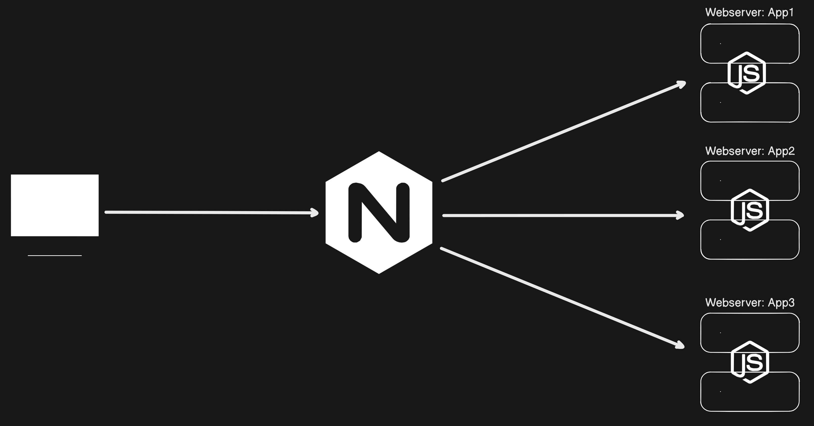

# Nginx Load Balancing with Docker Compose

This project demonstrates a setup where Nginx acts as a load balancer for three Node.js applications running in Docker containers. The configuration includes HTTPS support with self-signed SSL certificates.

> Process flow diagram
> 

---

## Features

-   **Load Balancing**: Distributes requests among three Node.js apps using the `least_conn` method.
-   **HTTPS Support**: Secures communication with SSL certificates.
-   **Automatic Redirection**: Redirects HTTP traffic to HTTPS.
-   **Dockerized Setup**: Easy deployment with Docker Compose.

---

## Prerequisites

-   **Docker** and **Docker Compose** installed on your system.
-   Basic knowledge of Docker and Nginx configuration.

---

## Project Structure

```
└── 📁master-nginx
    └── 📁certs
        └── nginx-selfsigned.crt
        └── nginx-selfsigned.key
    └── 📁images
        └── career-quiz.png
        └── devops.png
        └── devsecops.png
        └── it-beginners.png
    └── docker-compose.yaml
    └── Dockerfile
    └── index.html
    └── nginx.conf
    └── package-lock.json
    └── package.json
    └── README.md
    └── server.js
```

## Setup Instructions

### 1. Clone the Repository

```bash
git clone https://github.com/korngsamnang/master-nginx
cd master-nginx
```

### 2. Generate SSL Certificates

To enable HTTPS, you need SSL certificates. Use the following openssl command to generate self-signed certificates:

```bash
openssl req -x509 -nodes -days 365 -newkey rsa:2048 -keyout nginx-selfsigned.key -out nginx-selfsigned.crt
```

Explanation:

-   req: Initiates a certificate request.
-   x509: Creates a self-signed certificate instead of a certificate signing request (CSR).
-   nodes: Skips the option to encrypt the private key (no passphrase).
-   days 365: Validity period of the certificate (1 year).
-   newkey rsa:2048: Generates a new RSA key pair with 2048 bits.
-   keyout: Specifies the filename for the private key.
-   out: Specifies the filename for the certificate.

Place the generated nginx-selfsigned.crt and nginx-selfsigned.key files in the certs/ directory.

### 3. Build and Run the Containers

Run the following command to build and start the services:

```bash
docker-compose up --build -d
```

### 4. Access the Application

-   HTTPS: https://localhost
-   HTTP requests will be automatically redirected to HTTPS.

## Nginx Configuration

The nginx.conf file contains the following:

-   Upstream Block: Defines the load-balancing strategy (least_conn) and targets the three Node.js services (app1, app2, app3).
-   SSL Configuration: Uses self-signed certificates located in the certs/ directory.
-   HTTP to HTTPS Redirect: Ensures secure connections by redirecting HTTP traffic.

## Docker Compose Services

-   app1, app2, app3:

    -   Node.js applications running on the internal network.
    -   Not exposed to the host but accessible via the Nginx proxy.

-   nginx:

    -   Acts as a reverse proxy and load balancer.
    -   Listens on ports 80 (HTTP) and 443 (HTTPS).

## Troubleshooting

-   Check Logs: Use docker-compose logs to view logs for all services.
-   Rebuild Containers: If changes are made, rebuild with docker-compose up --build.
-   Certificate Errors: For development, bypass browser warnings for self-signed certificates.
